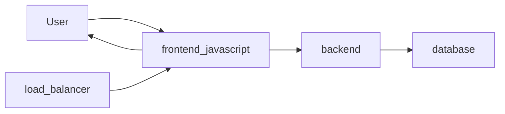

# Architectural Diagrams

Microservice Interactions:

The react-frontend is served from a load balancer to users navigating to `https://ourapp.example.com`.  From there, the front end is able to communicate with the backend over websockets.  As needed, the backend will read/ write data from the database, for example, when the user creates a new game, the game's state will be saved in the database allowing the player to reload the game as needed.

Saved Game State:

Ideally we should be able to load a game in progress.  The state of a game should be something like...

- The Galaxy's colonizers, systems, planets, colonies, squadrons,
- Elapsed time

Domain Model:

The domain model got huge so it lives [here](domain_model.md).  Usually I just model this in javascript somewhere so it never falls out of date, but I wound up getting distracted while figuring out what a saved game's state would look like.
