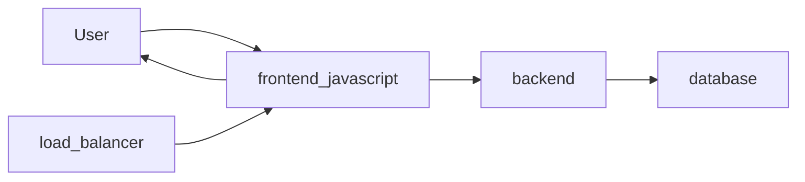

# Architectural Diagrams


##### Microservice Interactions:

The react-frontend is served from a load balancer to users navigating to `https://ourapp.example.com`.  From there, the front end is able to communicate with the backend over websockets.  As needed, the backend will read/ write data from the database, for example, when the user creates a new game, the game's state will be saved in the database allowing the player to reload the game as needed.



##### Current Work MindMap
I'm playing around with using mind maps because they help you get a better spacial sense about the work being done and helps me reason about how some domains of work might expand.

```
mindmap
    root((Pax <br/> Features))
        Get Web UX Ready for Customers
        ::icon(fa fa-star)
        Finish Pax Benchmark Gameplay
        ::icon(fa fa-star)
        Users management Feature
        ::icon(fa fa-star)
            Add backend support for "users management"
            ::icon(fa fa-book)
        B
        ::icon(fa fa-star)
        Automated Database Migrations
        ::icon(fa fa-star)
            I should use MongoDB, right?
            ::icon(fa fa-question)
```


##### Saved Game State:

Ideally we should be able to load a game in progress.  The state of a game should be something like...

- The Galaxy's colonizers, systems, planets, colonies, squadrons,
- Elapsed time

##### Complete Domain Model:

The domain model got huge so it lives [here](complete_domain_model.md).  Usually I just model this in javascript somewhere so it never falls out of date, but I wound up getting distracted while figuring out what a saved game's state would look like.

##### System Domain Model:

[This](system_model.md). is just a glimps of the Domain Model associated with Systems, so includes all the 3D/ Space stuff, but not the mundane User/ research/ etc stuff.
