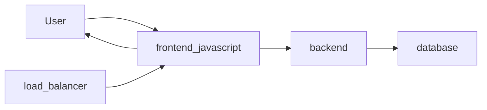
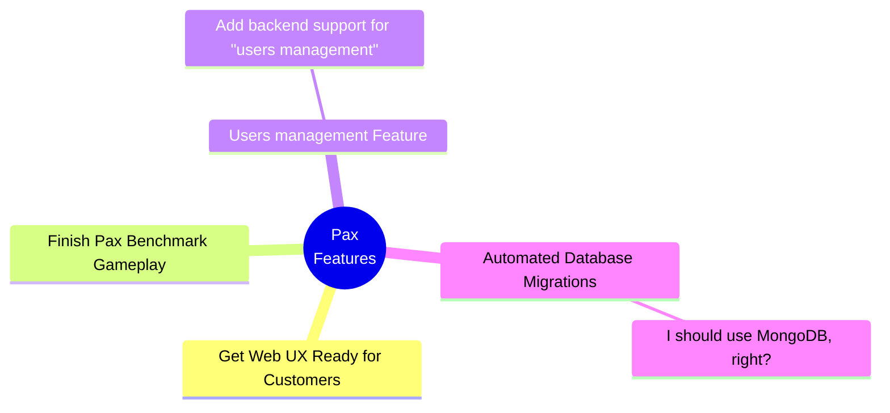

# Architectural Diagrams

##### Microservice Interactions:

The react-frontend is served from a load balancer to users navigating to `https://ourapp.example.com`.  From there, the front end is able to communicate with the backend over websockets.  As needed, the backend will read/ write data from the database, for example, when the user creates a new game, the game's state will be saved in the database allowing the player to reload the game as needed.

##### Current Work MindMap
I'm playing around with using mind maps because they help you get a better spacial sense about the work being done and helps me reason about how some domains of work might expand.

##### Saved Game State:

Ideally we should be able to load a game in progress.  The state of a game should be something like...

- The Galaxy's colonizers, systems, planets, colonies, squadrons,
- Elapsed time

##### Complete Domain Model:

The domain model got huge so it lives [here](complete_domain_model.md).  Usually I just model this in javascript somewhere so it never falls out of date, but I wound up getting distracted while figuring out what a saved game's state would look like.

##### System Domain Model:

[This](system_model.md). is just a glimps of the Domain Model associated with Systems, so includes all the 3D/ Space stuff, but not the mundane User/ research/ etc stuff.

#### Graphics Pipeline Diagram:

This section describes how a planet is rendered in orbit around it's sun.

###### SpaceViewWidget

At the top-most level, `SpaceViewWidget` will setup a camera and stuff via a call to `loadWidget`.  Currently, the widget is composed of 3 main classes: SpaceViewAnimator, SpaceViewDomManager and SpaceViewInputHandler.  

###### SpaceViewAnimator

 `spaceViewAnimator.animate()` will be called 60 times per second via the `requestAnimationFrame` API.  This renders to a canvas element at 60fps.  `SpaceViewAnimator` represents the main game loop and therefore has access to pretty much everything, including the system data.  The `SpaceViewAnimator` will iterate over all space entities, calling their respective update functions, one being `Planet#update()`.

###### Entity - Planet

We're now on the final stop of the Graphics Pipeline journey.  Planet objects enherit from the `Entity` class.  When `Planet#update()` is called, the position of the planet will be updated to account for the game time.  Orbits follow a simple calculation that is completely deterministic and so two clients need only know the initical configuration and the current time to draw the planets in a synchronized manor.
