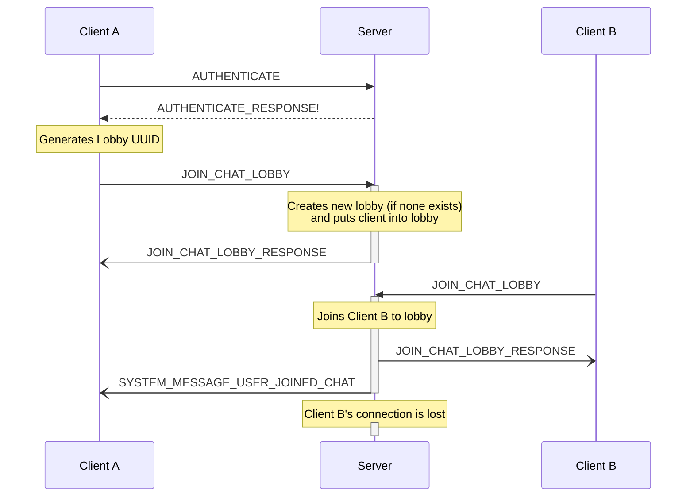

# Networking - Chat

###### Outbound Messages: Client
- [x] AUTHENTICATE
- [x] NEW_MESSAGE
- [x] JOIN_CHAT_LOBBY
- [ ] LEAVE_CHAT_LOBBY
- [x] GET_GAME_CONFIGURATION

###### Outbound Messages: Server
- [x] SYSTEM_MESSAGE_USER_JOINED_CHAT
- [x] SYSTEM_MESSAGE_USER_LEFT_CHAT
- [x] SYSTEM_MESSAGE_CHAT_USER_LIST
- [x] NEW_MESSAGE_FROM_SERVER

## ChatLobby

A user (Client A) hosts a game.  Client B joins the game.  Then Client B leaves the game.  Client C joins, and then Client A launches both players inot the game.

