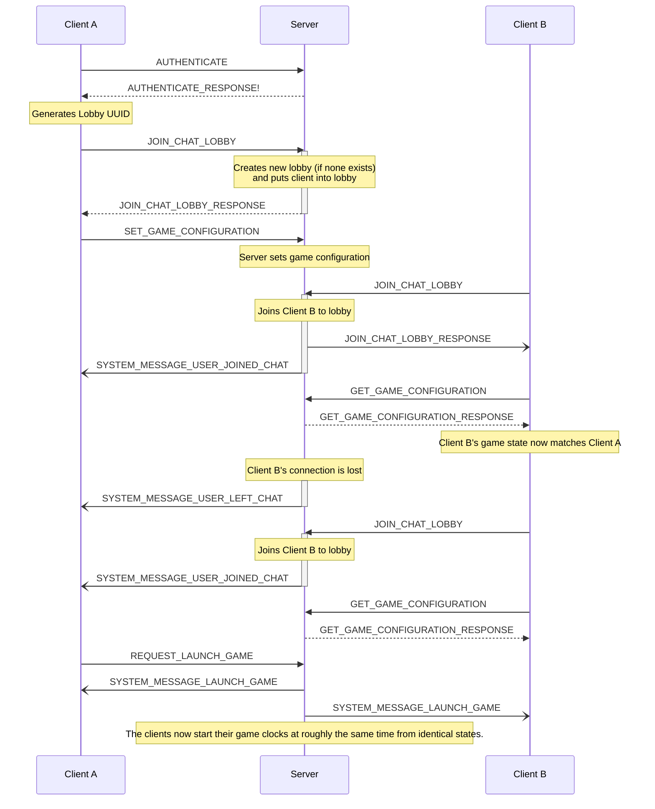
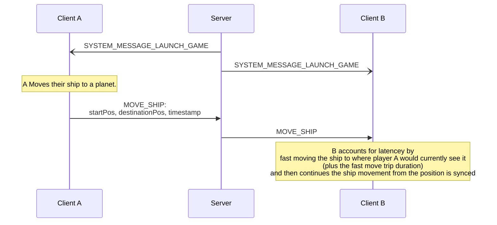

# Networking - Chat

## 1. Chat lobby formation to Game Launch

###### Outbound Messages: Client
- [x] AUTHENTICATE
- [x] NEW_MESSAGE
- [x] JOIN_CHAT_LOBBY
- [x] LEAVE_CHAT_LOBBY
- [x] SET_GAME_CONFIGURATION
- [x] GET_GAME_CONFIGURATION
- [ ] REQUEST_LAUNCH_GAME

###### Outbound Messages: Server
- [x] SYSTEM_MESSAGE_USER_JOINED_CHAT
- [x] SYSTEM_MESSAGE_USER_LEFT_CHAT
- [x] SYSTEM_MESSAGE_CHAT_USER_LIST
- [x] SYSTEM_MESSAGE_NEW_MESSAGE
- [ ] SYSTEM_MESSAGE_LAUNCH_GAME

A user (Client A) hosts a game.  Client B joins the game.  Then Client B leaves the game.  Client C joins, and then Client A launches both players inot the game.




## 2. Game launch to player movements

###### Outbound Messages: Client
- [ ] MOVE_SHIP
- [ ]
- [ ]




###### Server Validations:
- If the timestap is too old, the server discards the message and logs an attempted timestamp back-dating

###### Client Validations:
- If the starting position is incongruent from player B's perspective, the client sends an INVALID_COMMAND to the server, the server logs the invalid command.  If the client is "trusted" (an official referee, non-player client) or if all other players agree INVALID_COMMAND, the game is halted due to someone cheating.  Cheating can be allowed by players.


## 3. Periodic clock synchronization

```mermaid

```
