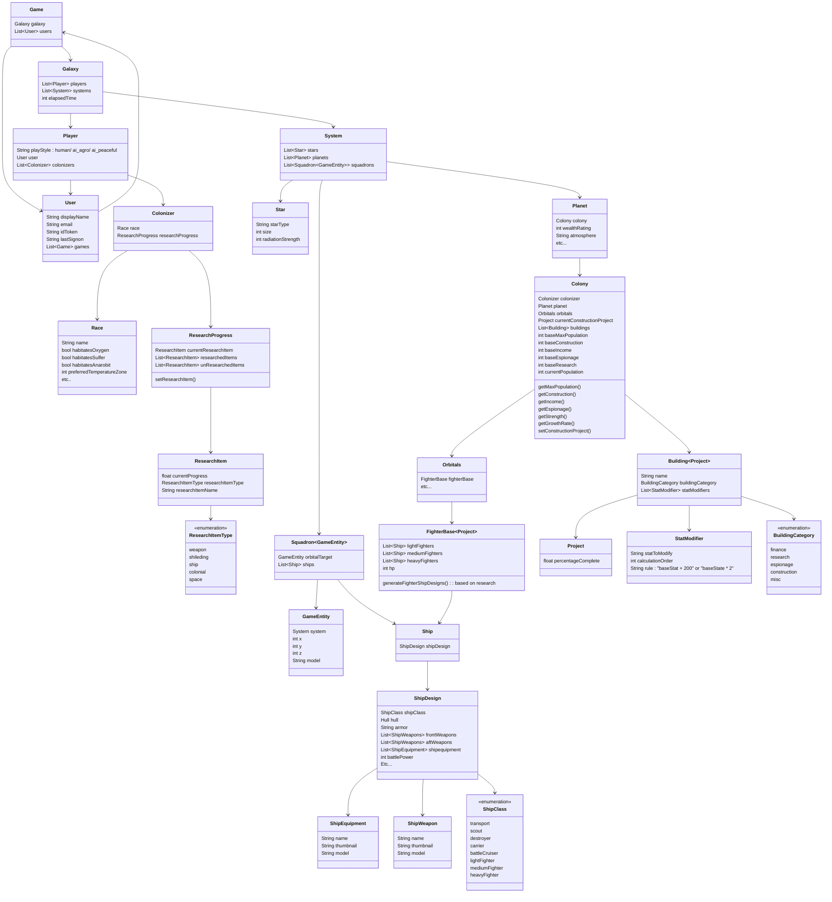

# Domain Model

```mermaid
classDiagram

  Game --> User
  Game --> Galaxy

  User --> Game

  Galaxy --> Player
  Galaxy --> System

  Player --> Colonizer
  Player --> User

  Colonizer --> Race
  Colonizer --> ResearchProgress

  ResearchProgress --> ResearchItem
  ResearchItem --> ResearchItemType

  System --> Star
  System --> Planet
  System --> Squadron~GameEntity~


  Planet --> Colony

  Squadron~GameEntity~ --> GameEntity
  Squadron~GameEntity~ --> Ship
  Ship --> ShipDesign
  ShipDesign --> ShipEquipment
  ShipDesign --> ShipWeapon
  ShipDesign --> ShipClass

  Colony --> Orbitals
  Colony --> Building~Project~

  Orbitals --> FighterBase~Project~

  FighterBase~Project~ --> Ship

  Building~Project~ --> Project
  Building~Project~ --> StatModifier
  Building~Project~ --> BuildingCategory


  class Game {
    Galaxy galaxy
    List~User~ users
  }

  class User {
    String displayName
    String email
    String idToken
    String lastSignon
    List~Game~ games
  }

  class Galaxy {
    List~Player~ players
    List~System~ systems
    int elapsedTime
  }
  class System {
    List~Star~ stars
    List~Planet~ planets
    List~Squadron~GameEntity~~ squadrons
  }
  class Player {
    String playStyle : human/ ai_agro/ ai_peaceful
    User user
    List~Colonizer~ colonizers
  }

  class Colonizer {
    Race race
    ResearchProgress researchProgress
  }

  class Race {
    String name
    bool habitatesOxygen
    bool habitatesSulfer
    bool habitatesAnarobit
    int preferredTemperatureZone
    etc..
  }

  class ResearchProgress {
    ResearchItem currentResearchItem
    List~ResearchItem~ researchedItems
    List~ResearchItem~ unResearchedItems
    setResearchItem()
  }

  class ResearchItem {
    float currentProgress
    ResearchItemType researchItemType
    String researchItemName
  }

  class ResearchItemType {
    <<enumeration>>
    weapon
    shileding
    ship
    colonial
    space
  }

  class Star {
    String starType
    int size
    int radiationStrength
  }

  class GameEntity {
    System system
    int x
    int y
    int z
    String model
  }

  class Squadron~GameEntity~ {
    GameEntity orbitalTarget
    List~Ship~ ships
  }

  class Planet {
    Colony colony
    int wealthRating
    String atmosphere
    etc...
  }

  class Colony {
    Colonizer colonizer
    Planet planet
    Orbitals orbitals
    Project currentConstructionProject
    List~Building~ buildings
    int baseMaxPopulation
    int baseConstruction
    int baseIncome
    int baseEspionage
    int baseResearch
    int currentPopulation
    getMaxPopulation()
    getConstruction()
    getIncome()
    getEspionage()

    getStrength()
    getGrowthRate()

    setConstructionProject()
  }

  class Project {
    float percentageComplete
  }

  class Orbitals {
    FighterBase fighterBase
    etc...
  }

  class Building~Project~ {
    String name
    BuildingCategory buildingCategory
    List~StatModifier~ statModifiers
  }

  class BuildingCategory {
    <<enumeration>>
    finance
    research
    espionage
    construction
    misc
  }

  class StatModifier {
    String statToModify
    int calculationOrder
    String rule : "baseStat + 200" or "baseState * 2"
  }

  class FighterBase~Project~ {
    List~Ship~ lightFighters
    List~Ship~ mediumFighters
    List~Ship~ heavyFighters
    int hp
    generateFighterShipDesigns() : based on research
  }

  class Ship ~Project~ {
    ShipDesign shipDesign
  }

  class ShipDesign {
    ShipClass shipClass
    Hull hull
    String armor
    List~ShipWeapons~ frontWeapons
    List~ShipWeapons~ aftWeapons
    List~ShipEquipment~ shipequipment
    int battlePower
    Etc...
  }

  class ShipClass {
    <<enumeration>>
    transport
    scout
    destroyer
    carrier
    battleCruiser
    lightFighter
    mediumFighter
    heavyFighter
  }

  class ShipWeapon {
    String name
    String thumbnail
    String model
  }

  class ShipEquipment {
    String name
    String thumbnail
    String model
  }

```