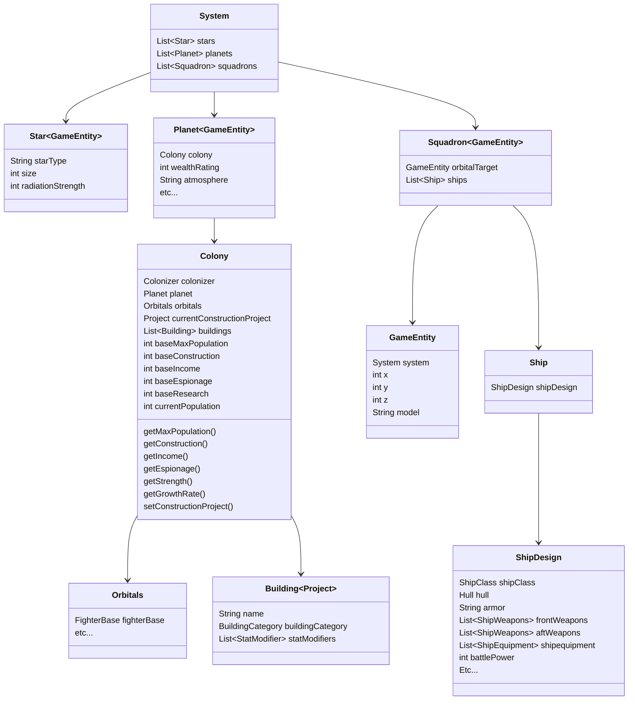

# System Model

```mermaid
classDiagram
  System --> Star~GameEntity~
  System --> Planet~GameEntity~
  System --> Squadron~GameEntity~

  Planet~GameEntity~ --> Colony

  Squadron~GameEntity~ --> GameEntity
  Squadron~GameEntity~ --> Ship
  Ship --> ShipDesign

  Colony --> Orbitals
  Colony --> Building~Project~

  class System {
    List~Star~ stars
    List~Planet~ planets
    List~Squadron~ squadrons
  }

  class Star {
    String starType
    int size
    int radiationStrength
  }

  class GameEntity {
    System system
    int x
    int y
    int z
    String model
  }

  class Squadron~GameEntity~ {
    GameEntity orbitalTarget
    List~Ship~ ships
  }

  class Planet {
    Colony colony
    int wealthRating
    String atmosphere
    etc...
  }

  class Colony {
    Colonizer colonizer
    Planet planet
    Orbitals orbitals
    Project currentConstructionProject
    List~Building~ buildings
    int baseMaxPopulation
    int baseConstruction
    int baseIncome
    int baseEspionage
    int baseResearch
    int currentPopulation
    getMaxPopulation()
    getConstruction()
    getIncome()
    getEspionage()

    getStrength()
    getGrowthRate()

    setConstructionProject()
  }

  class Orbitals {
    FighterBase fighterBase
    etc...
  }

  class Building~Project~ {
    String name
    BuildingCategory buildingCategory
    List~StatModifier~ statModifiers
  }

  class Ship ~Project~ {
    ShipDesign shipDesign
  }

  class ShipDesign {
    ShipClass shipClass
    Hull hull
    String armor
    List~ShipWeapons~ frontWeapons
    List~ShipWeapons~ aftWeapons
    List~ShipEquipment~ shipequipment
    int battlePower
    Etc...
  }

```